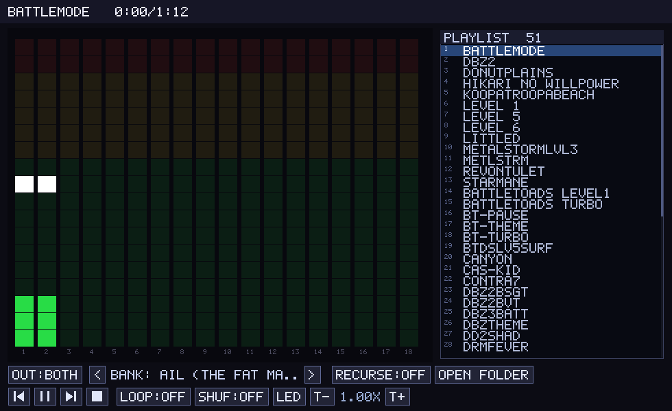

# OPL3 RetroWave MIDI Player

Play **any Standard MIDI File** (`.mid`) three ways, switchable at runtime:

- on a real Yamaha **YMF262 (OPL3)** via a
  [RetroWave OPL3 Express](https://github.com/SudoMaker/RetroWave) board over
  USB-serial (FM synthesis by [libADLMIDI](https://github.com/Wohlstand/libADLMIDI)),
- on your **PC speakers** through a software OPL3 emulator, or
- forwarded as **raw MIDI to an external hardware synth** (e.g. a General MIDI
  module on a USB-MIDI cable) via ALSA.

A GUI-first player with a Winamp-style playlist, live OPL3 visualizer, and
settings that persist between runs.



## Features

- **Load folders** of MIDIs, optionally recursing into subfolders.
- **Winamp-style playlist**: scroll (wheel / arrows / PgUp-PgDn / Home-End),
  click a track to play, current row highlighted.
- **Shuffle** (preserves the currently playing track when toggled).
- **Output** — OPL3 **Board** / **PC** / **External MIDI**, mutually exclusive,
  switched live. Falls back to PC if no board is connected.
- **Picker** that is the FM **bank** list (libADLMIDI's ~79 built-in banks) for
  Board/PC output, and the **ALSA device** list in External-MIDI mode.
- **Channel visualizer** driven by the real OPL3 register stream (LED / neon /
  spectrum), plus play/pause/next/prev/stop, loop, and tempo.
- **Remembers your settings** (bank, recurse, loop, shuffle, style, output) in
  `~/.config/opl3-rw-midi-player/config`.

---

## Requirements

**To build from source:** a C++17 compiler, `cmake`, `git`, and the SDL2 + ALSA
dev packages:

```sh
sudo apt install build-essential cmake git libsdl2-dev libasound2-dev
```

**To build the snap:** `snapcraft` and `lxd`:

```sh
sudo snap install snapcraft --classic
sudo snap install lxd && sudo lxd init --auto
```

**Hardware (optional):** a RetroWave OPL3 Express (USB-serial, 2 Mbaud) for
Board output; any ALSA MIDI device for External output. Neither is required —
without them the player uses PC audio.

---

## Build from source

```sh
./build.sh          # fetches + builds libADLMIDI (static), then the player
./build.sh fast     # rebuild just the player after editing src/
```

This produces `./opl3-rw-midi-player`. Run it:

```sh
./opl3-rw-midi-player ~/midis/            # GUI, board on /dev/ttyACM0 + PC fallback
./opl3-rw-midi-player -d - ~/midis/       # GUI, no hardware (dry-run board, PC audio)
./opl3-rw-midi-player --list-banks        # list FM instrument banks
./opl3-rw-midi-player --list-midi         # list external ALSA MIDI ports
```

---

## Install as a snap

### 1. Build and install

```sh
snapcraft                                                    # produces the .snap
sudo snap install ./retro-midi-player-opl3-gm_1.0_amd64.snap --dangerous
```

`--dangerous` allows installing a locally-built, unsigned snap. The first
install also pulls the shared `gnome-46-2404` platform (one-time, a few hundred
MB) that provides GTK for the "Open Folder" dialog.

### 2. Connect the hardware interfaces — **required for Board and MIDI output**

The snap is **strictly confined**. Display, PC audio, and home-folder access
connect automatically, but the two hardware outputs need a manual connection —
without them you'll see `Operation not permitted` errors and the player falls
back to PC audio only.

**External MIDI device (ALSA):**

```sh
sudo snap connect retro-midi-player-opl3-gm:alsa
```

**RetroWave OPL3 board (serial port):** on classic Ubuntu there is no
`serial-port` slot until you enable snapd's *hotplug* feature, which then
detects your USB-serial device and creates a slot for it. With the board
plugged in:

```sh
# 1. Enable hotplug (one-time, system-wide) and restart snapd.
sudo snap set system experimental.hotplug=true
sudo systemctl restart snapd

# 2. Find the slot snapd created — it's named after the device's USB descriptor.
sudo snap interface serial-port
#   ...
#   slots:
#     - snapd:retrowaveopl3express   <-- your slot name (varies by device)

# 3. Connect your snap's plug to that slot.
sudo snap connect retro-midi-player-opl3-gm:serial-port snapd:retrowaveopl3express
```

> The slot name (`retrowaveopl3express` above) is derived from the board's USB
> product string, so copy whatever `snap interface serial-port` shows under
> `slots:`. If no slot appears, make sure the board is plugged in and that you
> restarted snapd after enabling hotplug.

### 3. Verify and run

```sh
snap connections retro-midi-player-opl3-gm   # :alsa and :serial-port should show "connected"
retro-midi-player-opl3-gm --list-midi        # should list your external MIDI device
retro-midi-player-opl3-gm ~/midis/           # launch; cycle OUT: to Board / EXT-MIDI
```

Re-installing the snap resets these manual connections — re-run the two `snap
connect` commands (hotplug stays enabled, so the slot is already there).

### Notes for the snap

- **Settings and config** live in the snap's own data dir
  (`~/snap/retro-midi-player-opl3-gm/current/.config/...`), not your global
  `~/.config`.
- **Loading music:** the `home` interface (auto-connected) lets the player read
  MIDI files under your home directory; `removable-media` covers USB drives
  (connect it if needed: `sudo snap connect retro-midi-player-opl3-gm:removable-media`).
- **Command name:** the snap installs as `retro-midi-player-opl3-gm` (the
  from-source binary is `opl3-rw-midi-player`).
- **Open Folder** uses the GTK file dialog provided by the GNOME platform.

---

## Usage

```sh
opl3-rw-midi-player [options] [folder | file.mid ...]
```

| Option | Description |
|---|---|
| `-d DEV` | RetroWave serial device (default `ttyACM0`; `-` = dry-run, `none` = PC only) |
| `-m PORT` | External ALSA MIDI device (`20:0`, a client name, or `auto`) |
| `-r` | Recurse into subfolders when scanning |
| `-b N` | Start on FM bank `#N` (default: a General-MIDI-ish bank) |
| `-s` | Start with shuffle on |
| `-l` | Loop the current track |
| `--no-gui` | Headless playback (Ctrl-C to quit) |
| `--list-banks` | Print the FM instrument banks and exit |
| `--list-midi` | Print available external MIDI ports and exit |

Command-line flags override the saved settings for that run.

### GUI controls

`space` play/pause · `n` next track · `p` prev track · `s` stop · `l` loop ·
`h` shuffle · `v` visualizer style · `o` cycle output (Board/PC/EXT-MIDI) ·
`+`/`-` tempo · `q`/`Esc` quit.

**Playlist:** click a row to play it; mouse-wheel or `↑`/`↓` scroll a line;
`←`/`→` (or `PgUp`/`PgDn`) scroll a page; `Home`/`End` jump. The `OUT:` button
switches output; the `< >` control changes the FM bank (Board/PC) or the ALSA
device (External); **Open Folder** adds music (needs `zenity`/`kdialog` when run
from source; bundled in the snap).

---

## How it works

libADLMIDI is the MIDI sequencer + FM voice allocator. For **FM output** the
player swaps libADLMIDI's internal OPL3 chip for a custom one (`FanoutOPL3`)
that mirrors **every** register write to both the RetroWave board and an
embedded DOSBox OPL3 emulator — so the board and the PC audio come from one
register stream, in sync, clocked by the SDL audio callback. For **External
MIDI** output it instead taps libADLMIDI's raw MIDI-event hook and forwards the
original note/program/controller events to an ALSA port, so a hardware synth
plays them with its own voices. See [CLAUDE.md](CLAUDE.md) for the full
architecture.

---

## Credits & license

- FM synthesis + built-in banks: [libADLMIDI](https://github.com/Wohlstand/libADLMIDI)
  (Vitaly Novichkov), LGPL-2.1+.
- The custom-`OPLChipBase` fan-out technique: SudoMaker's
  [midi2vgm](https://github.com/SudoMaker/midi2vgm), AGPL-3.0.
- RetroWave wire framing (`src/retrowave_serial.c`): SudoMaker
  [RetroWave](https://github.com/SudoMaker/RetroWave), AGPL-3.0.
- DOSBox OPL3 emulator (`src/emu/opl.c`) and the visualizer: the sibling
  [descent-hmp-player](../descent-hmp-player) / tyrian-retrowave, LGPL-2.1+ / GPL.

Distributed under the GNU AGPLv3 (or later), consistent with its inputs. MIDI
files are your own and are not redistributed.
